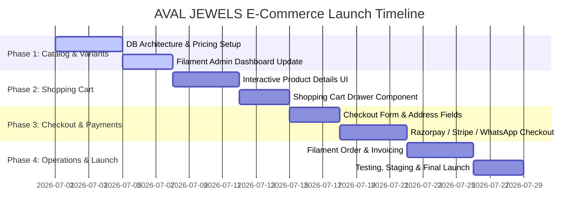

# Project Roadmap: E-Commerce Transition for AVAL JEWELS
**Tagline:** *Wear your confidence everyday*  
**Founder:** Pushpa Menon  

This document presents a structured, phase-by-phase execution plan to upgrade the **AVAL JEWELS** website from a catalog demo to a premium online jewelry boutique with seamless ordering.

---

## Executive Summary

The transition will convert the existing showcase website into a premium online boutique using a rich design language (maroon, gold, cream, and olive accents matching the "House of Aval" brand identity). We will implement a highly secure, easy-to-use checkout flow tailored for luxury products, supporting both standard online card/UPI payments and direct-to-WhatsApp ordering.

---

## Phase-by-Phase Roadmap

---

### Phase 1: Advanced Catalog & Product Variants
*Goal: Lay the database foundations and give the admin full control over pricing, inventory, and jewelry configurations.*

*   **Database Expansion:**
    *   Add fields for base price, sale/discounted price, and current stock level.
    *   Create a schema to handle product variations (e.g., ring size, gold purity like 18K/22K, net weight, or diamond clarity).
*   **Filament Admin Upgrades:**
    *   Redesign the **Product Management Dashboard** to allow the admin to add, edit, and delete product variants.
    *   Add stock alerts (low stock notifications) to the dashboard.
*   **Client Review Checkpoint:**
    *   Review the admin interface to confirm that entering prices, sizes, and weights is intuitive.

---

### Phase 2: Premium Shopping Cart Experience
*Goal: Build an interactive, luxury-themed shopping experience for visitors.*

*   **Dynamic Product Page Features:**
    *   Display dynamic pricing based on selected metal purity (e.g., price updates if the user switches from 18K to 22K gold).
    *   Add a weight details breakdown to build trust.
*   **Interactive Shopping Cart:**
    *   Develop a **Slide-out Cart Drawer** that keeps users on the same page when adding items.
    *   Maintain subtotal calculations in real-time with beautiful micro-animations.
*   **Client Review Checkpoint:**
    *   Interactive walkthrough of the user adding items to the cart and adjusting quantities.

---

### Phase 3: Address Checkout & Payment Gateways
*Goal: Provide customers with secure, flexible payment methods.*

*   **Address Collection Form:**
    *   Create a streamlined checkout page collecting delivery name, verified phone number, email, and shipping address.
*   **Dual Checkout Paths:**
    *   **Path A: Payment Gateway Integration**
        *   Integrate **Razorpay** (recommended for UPI, NetBanking, and credit/debit cards in India) or **Stripe**.
    *   **Path B: Direct WhatsApp Checkout**
        *   For customers preferring direct contact: generates the order in the database and redirects the customer to a pre-filled WhatsApp message sent to Pushpa Menon (Founder) with the order details and items.
*   **Client Review Checkpoint:**
    *   Test transactions in sandbox/test mode to verify billing.

---

### Phase 4: Order Management, Invoicing & Launch
*Goal: Complete backend fulfillment tools, test end-to-end, and go live.*

*   **Filament Order Dashboard:**
    *   Create the **Order Manager** in the admin panel to view new orders, customer details, and payment receipts.
    *   Add order status management: `Pending` ➔ `Processing` ➔ `Shipped` (with tracking ID input) ➔ `Delivered`.
*   **Invoicing & Communications:**
    *   Integrate automated PDF invoice generation.
    *   Send email order notifications to both the customer and admin.
*   **Final Launch Prep:**
    *   Complete compatibility testing on mobile, tablet, and desktop devices.
    *   Deploy to live server.

---

## Suggested Freelancer Payment Milestones

To ensure a smooth project flow, we recommend aligning payments with deliverables:

| Milestone | Phase Focus | Deliverable | Payment Release |
| :--- | :--- | :--- | :--- |
| **Milestone 1** | **Project Kickoff** | Approved Phase Plan & DB Migration Setup | **25%** |
| **Milestone 2** | **Phase 1 & 2** | Catalog pricing, product variants, and Cart Drawer UI | **25%** |
| **Milestone 3** | **Phase 3** | Form validation & Working Payment Gateway (UPI/Stripe/WhatsApp) | **30%** |
| **Milestone 4** | **Phase 4 & Launch** | Admin Order dashboard, Email notifications, and Live Deployment | **20%** |
